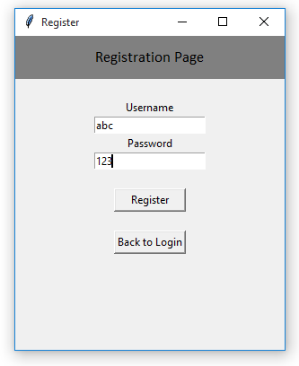
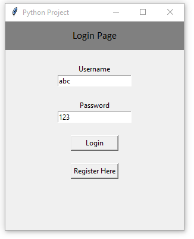

# Login and Registration System

This is a simple login and registration system implemented in Python using the Tkinter library. The program allows users to register with a username and password, and then log in with their credentials.

## Features

- User registration
- User login
- Password validation
- Error handling for invalid credentials

## Usage

1. Clone the repository

2. Change to the project directory:

   ```bash
   cd login-registration-system
   ```

3. Install the required dependencies. If you have Python and Tkinter installed, you should be good to go.

4. Run the program:

   ```bash
   python login_system.py
   ```
## Screenshots
<div style="display: flex; justify-content: space-between;">
  
  
  
</div>

